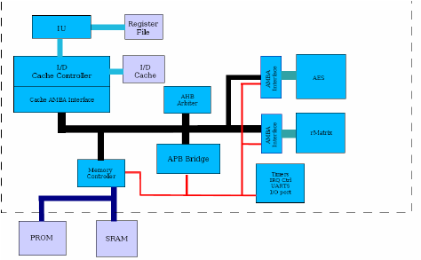

# Week 2 Task 2 – BabySoC Fundamentals & Functional Modelling

## 1. What is a System-on-Chip (SoC)?

A **System-on-Chip (SoC)** is an integrated chip that combines the **CPU, memory, peripherals, and interconnect** all in one place.

- **CPU:** Acts as the brain of the system, executes instructions, and controls the operation of the system.  
- **Memory:** Stores programs and data. There are two main types:  
  - **ROM/Flash:** Permanent storage  
  - **RAM:** Temporary storage  
- **Peripherals:** Devices that act as an interface between the CPU and the outside world, such as UART, GPIO, SPI, I2C.  
- **Interconnect/Bus:** Connects the CPU, memory, and peripherals and allows data transfer.  

**Applications:** SoCs are widely used in smartphones, IoT devices, embedded systems, and automotive systems. They reduce **power consumption, area, and cost** while providing efficient design.

---

## 2. Components of a Typical SoC

The main components of a SoC are:

- **CPU (Central Processing Unit):** Responsible for computation and control  
- **Memory:** Stores programs and data (ROM/Flash + RAM)  
- **Peripherals:** Interfaces for communication with external devices  
- **Interconnect/Bus:** Provides communication between CPU, memory, and peripherals  

**Block Diagram of a Typical SoC:**  



---

## 3. Why BabySoC?

- **BabySoC** is a simplified SoC model designed for learning purposes.  
- Real-world SoCs are very complex, so BabySoC contains only **essential components**: CPU, memory, simple bus, and basic peripherals.  
- It provides students a **perfect platform to understand basic SoC design concepts**.  

**Summary:** BabySoC is a **teaching SoC** that helps beginners learn fundamental SoC concepts easily.

---

## 4. Role of Functional Modelling

- Functional modelling allows designers to **check the logical behavior** of the design before starting RTL or physical implementation.  
- It ensures that the **CPU, memory, and peripherals communicate correctly**.  
- Functional modelling helps detect **design errors early**, saving both time and cost.  
- **Tools:** Icarus Verilog (for simulation) and GTKWave (for waveform visualization)

**Example (simple behavior check):**  

```text
CPU sends data -> Memory stores data -> Peripheral reads data
```

## 5. References / Useful Links

- [SoC Design Fundamentals & Functional Modelling Video](https://youtu.be/TrTp572FgFo?si=zqM3BhDOcvgk-HSV) – VLSI System Design

## 6. Conclusion

SoC: A complete computer system on a single chip.

BabySoC: A simplified learning platform for understanding SoC fundamentals.

Functional Modelling: An important step before RTL and physical design.

From this task, students can understand the overall concept of SoC and its simulation process.