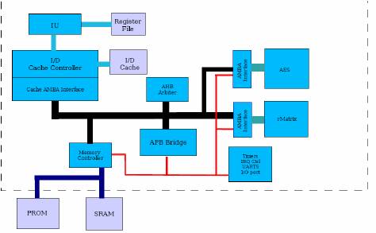

1. What is a System-on-Chip (SoC)?

A System-on-Chip (SoC) is an integrated circuit that combines the main components of a complete computer system into a single chip.
It integrates:

Processor (CPU) – executes instructions

Memory – stores data and program code

Peripherals – interfaces for input/output (like timers, UART, GPIO)

Interconnect/Bus – connects CPU, memory, and peripherals

SoCs are widely used in smartphones, IoT devices, automotive systems, and embedded products because they reduce power, area, and cost.

2. Components of a Typical SoC

CPU (Central Processing Unit): Brain of the system, handles computation and control.

Memory: Includes program memory (ROM/Flash) and data memory (RAM).

Peripherals: Interfaces to interact with the outside world (e.g., UART, GPIO, SPI, I2C).

Interconnect: Communication backbone that connects CPU, memory, and peripherals.

A simple block diagram of an SoC looks like this:

1. Why BabySoC?

The BabySoC is a simplified SoC model designed for learning.

It avoids the complexity of industry-scale SoCs.

Focuses only on essential elements: CPU, memory, simple bus, and minimal peripherals.

Helps students understand the fundamental concepts of SoC design without being overwhelmed by advanced details.

Thus, BabySoC acts as a teaching SoC for beginners.

4. Role of Functional Modelling

Before going to RTL design and physical design, it is important to check functionality at a high level.

Functional modelling = Simulating how the SoC should behave logically.

Ensures correct communication between CPU, memory, and peripherals.

Helps detect design flaws early, saving time and cost.

Performed using tools like Icarus Verilog (for simulation) and GTKWave (for waveform visualization).

5. Conclusion

A System-on-Chip is a compact, integrated computer system on a single chip.

Understanding CPU, memory, peripherals, and interconnect is the key to SoC design.

BabySoC provides a simplified platform to practice these concepts.

Functional modelling is a critical step before moving to RTL and physical design.

This exercise builds the foundation for the complete SoC design journey.